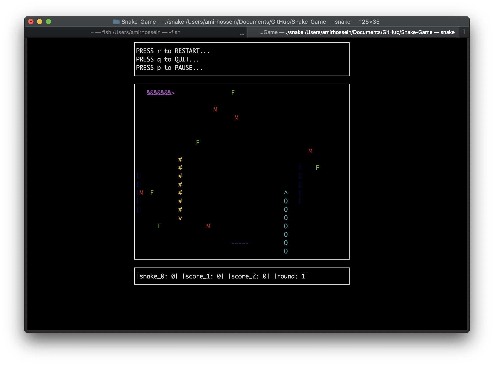

# Snake-Game
Multiplayer snake game using pthread in c

Multiplayer multithreaded snake game using pthread library in c.
 
Please use the following command to compile:
```
gcc snake_pth.c -o snake -lpthread -lcurses
```
Then run the program using the following command:
```
./snake
```
Here is a screenshot of the game:


